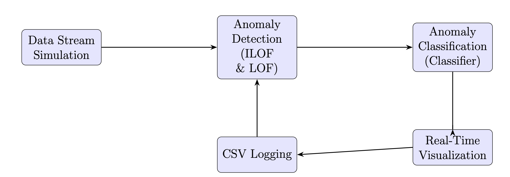
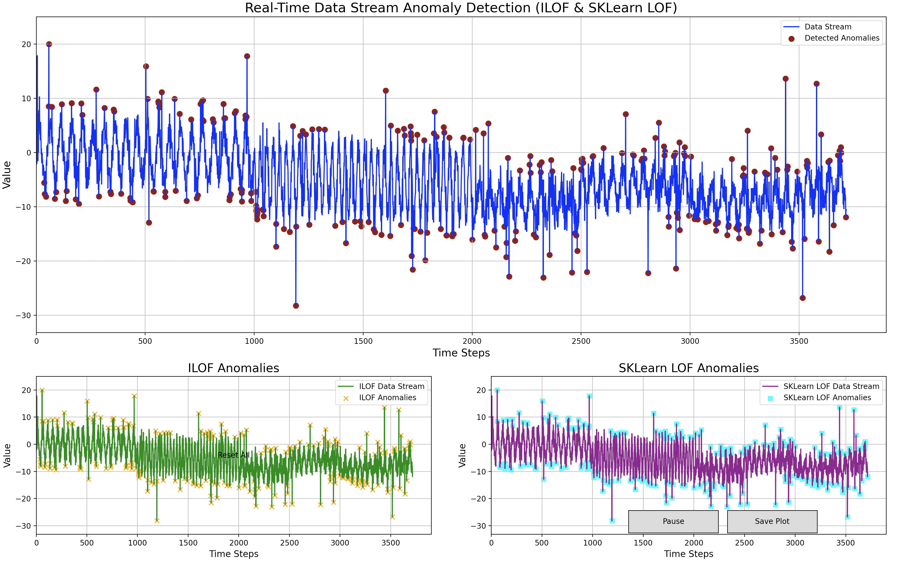

# Efficient Data Stream Anomaly Detection



## Introduction

In today’s data-driven landscape, the ability to detect anomalies in real-time data streams is paramount. Whether monitoring financial transactions for fraud, overseeing system metrics for performance issues, or analyzing sensor data for irregularities, efficient anomaly detection ensures timely interventions and maintains system integrity. This project presents a Python-based solution tailored to detect anomalies in continuous data streams, effectively addressing challenges such as concept drift and seasonal variations.

## Features

- **Real-Time Data Stream Simulation:** Generates dynamic data streams with seasonality, trend shifts, noise, and injected anomalies.
- **Dual Anomaly Detection Algorithms:** Integrates both Incremental Local Outlier Factor (ILOF) and Scikit-Learn’s Local Outlier Factor (LOF) for comprehensive anomaly detection.
- **Anomaly Classification:** Distinguishes between justified and unjustified anomalies using a Logistic Regression classifier.
- **CSV Logging:** Records all detected anomalies with detailed information, including classification and confidence scores.
- **Interactive Visualization:** Provides real-time plots of the data stream and detected anomalies with user controls for pausing and saving plots.
- **Robust Error Handling:** Ensures reliable performance with mechanisms to handle data synchronization and parameter updates.

## Algorithms Overview

### Incremental Local Outlier Factor (ILOF)

**ILOF** excels in environments characterized by **dynamic data streams and concept drift**, where the underlying data distribution evolves over time. Its primary strengths include:

- **Adaptability to Concept Drift:** Continuously updates its model in real-time using a sliding window mechanism, ensuring responsiveness to changing data patterns.
- **Dynamic Learning:** Incorporates new data points incrementally without retraining from scratch, making it suitable for real-time applications.
- **Contextual Density Analysis:** Evaluates local densities relative to immediate neighbors, effectively handling seasonal variations.

**Limitations:**

- **Precision in Anomaly Detection:** While highly adaptable, ILOF may have lower precision in pinpointing exact anomalies compared to more static models like LOF.
- **Computational Overhead:** Maintaining and updating the model incrementally can introduce computational challenges, especially with high-velocity data streams.

### Local Outlier Factor (LOF)

**LOF** is renowned for its **high precision in identifying outliers within static or relatively stable datasets**. Key advantages include:

- **High Precision:** Effectively distinguishes anomalies from normal variations by analyzing local density deviations.
- **Mature Implementation:** Leveraging Scikit-Learn’s optimized algorithms ensures reliability and performance.
- **Ease of Integration:** Simple to implement and integrate into existing systems with minimal configuration.

**Limitations:**

- **Sensitivity to Concept Drift:** LOF is less adaptable to evolving data distributions, which can lead to decreased detection accuracy as data patterns shift.
- **Parameter Sensitivity:** The performance of LOF heavily depends on parameter settings (e.g., number of neighbors), requiring careful tuning for optimal results.

## Anomaly Classification

To enhance the contextual understanding of detected anomalies, a **Logistic Regression classifier** is integrated into the system. This classifier distinguishes between:

- **Justified Anomalies:** Caused by legitimate external factors (e.g., macroeconomic events, significant market movements).
- **Unjustified Anomalies:** Resulting from data discrepancies, system errors, or internal issues.

**Implementation Highlights:**

- **Pipeline Composition:** Combines `StandardScaler` for feature scaling with `LogisticRegression` for classification.
- **Feature Engineering:** Utilizes LOF scores from both ILOF and LOF as input features for the classifier.
- **Training Data:** Initially trained on synthetic placeholder data; for practical applications, it should be trained with real labeled datasets.

## Installation

1. **Clone the Repository:**
    ```bash
    git clone https://github.com/yourusername/efficient-data-stream-anomaly-detection.git
    cd efficient-data-stream-anomaly-detection
    ```

2. **Create a Virtual Environment (Optional but Recommended):**
    ```bash
    python3 -m venv venv
    source venv/bin/activate  # On Windows: venv\Scripts\activate
    ```

3. **Install Dependencies:**
    ```bash
    pip install -r requirements.txt
    ```

## Usage

Run the main Python script to start the real-time anomaly detection system:

```bash
python anomaly_detection.py
```

**Controls:**

- **Pause/Play Button:** Toggle the real-time animation between pause and play states.
- **Save Plot Button:** Save the current state of the plots as an image.

## Visualization

The system provides real-time visualization of the data stream and detected anomalies using Matplotlib. It includes:

- **Main Plot:** Combines data streams from both ILOF and LOF, highlighting detected anomalies.
- **Individual Plots:** Separate plots for ILOF and LOF anomalies, providing detailed views.
- **Interactive Controls:** Buttons for pausing/resuming the animation and saving the current plot.

**Example Visualization:**



## CSV Logging

All detected anomalies are logged into a `anomalies.csv` file with the following columns:

- **Time Step:** The specific point in the data stream when the anomaly was detected.
- **Value:** The anomalous data point's value.
- **Detector:** The algorithm(s) (`ILOF` and/or `LOF`) that identified the anomaly.
- **Classification:** Indicates whether the anomaly is `Justified` or `Unjustified`.
- **Confidence:** The classifier's confidence score in its classification decision.

**Sample Entry:**

| Time Step | Value  | Detector    | Classification | Confidence |
|-----------|--------|-------------|----------------|------------|
| 1500      | 20.5   | ILOF, LOF   | Justified      | 0.95       |

## Requirements

The project leverages the following external libraries:

- **numpy**
- **matplotlib**
- **scikit-learn**

Ensure these are installed via the `requirements.txt` file.

## Contributing

Contributions are welcome! Please follow these steps:

1. **Fork the Repository**
2. **Create a Feature Branch**
    ```bash
    git checkout -b feature/YourFeature
    ```
3. **Commit Your Changes**
4. **Push to the Branch**
    ```bash
    git push origin feature/YourFeature
    ```
5. **Open a Pull Request**

Please ensure that your contributions adhere to the project's coding standards and include appropriate documentation.

## License

This project is licensed under the [MIT License](LICENSE).

## Contact

For any inquiries or feedback, please contact:

**Your Name**
[your.email@example.com](mailto:your.email@example.com)
[https://github.com/yourusername](https://github.com/yourusername)

---

**Note:** Replace placeholders like `yourusername`, `your.email@example.com`, and image paths with your actual GitHub username, email, and image file locations respectively.
